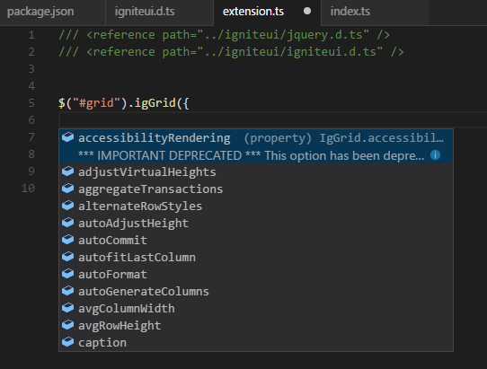

# Ignite UI IntelliSense for Visual Studio Code

This extension adds IntelliSense for IgniteUI controls to your visual Visual Studio Code.





#Getting Started
1. This extension creates a folder named 'igniteui' in the root directory of your application. jQuery and IgniteUI TypeScript definitions are downloaded in this folder.
2. Include references to this files in your application.

    ```html
    /// <reference path="../igniteui/jquery.d.ts" />
    /// <reference path="../igniteui/igniteui.d.ts" />
    ```

3. Voila - ItelliSense for Ignite UI controls is avaliable in your application.

#Running in GitHub
To run the extension, you need [Node.js](https://nodejs.org/en/) installed.

1. git clone https://github.com/IgniteUI/ignite-ui-IntelliSense-for-VS-Code.git
2. Open folder in VS Code.
3. Press F5 to open a new VS Code window with your extension loaded.
4. Open the application that you want to enable the extension for.
5. Press Ctrl+Shift+P and type IgniteUI IntelliSense.
6. Include references to the files in the newly created folder.

    ```html
    /// <reference path="../igniteui/jquery.d.ts" />
    /// <reference path="../igniteui/igniteui.d.ts" />
    ```


-----------------------------------------------------------------------------------------------------------

